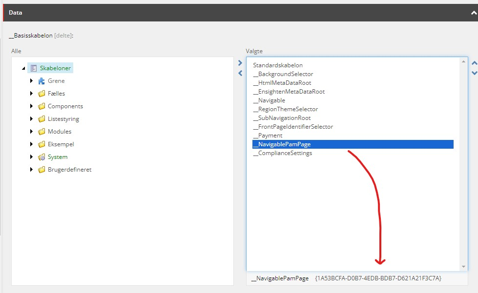

# DS Chrome Udvidelse

En Chrome udvidelse med værktøjer til Danske Spil relaterede sites og Jira.

## Hurtig Start

1. [Download](https://github.com/tennisfar/DS-Chrome-Udvidelse/releases/latest) den seneste release, eller klon koden med Git.
2. Åbn `chrome://extensions/`.
3. Slå Developer mode til.
4. Vælg `Load unpacked`.
5. Peg på projektmappen.
6. Bekræft at udvidelsen er aktiv.

## Opdateringer

### Version 1.11
På Klasselotteriets lokal- og townmiljøer, ved klik på loginknappen, ledes du normalt til MitID loginsiden når du forsøger at logge ind. Da denne ikke er aktuel på disse miljøer, springes dette step over, og du føres i stedet direkte til brugernavnslogin.

### Version 1.10
Knappen "Vis komponenter på siden" virker nu også på Klasselotteriet.

### Version 1.9.4
Tilføjet mulighed for at gemme kundenumre på Klasselotteriets loginside, så man ikke skal indtaste dem hver gang.

### Version 1.8
Sitecore layoutændringer virker nu også for Klasselotteriet.

### Version 1.7
På Danske Spil's lokal- og townmiljøer, ved klik på loginknappen, ledes du normalt til MitID loginsiden når du forsøger at logge ind. Da denne ikke er aktuel på disse miljøer, springes dette step over, og du føres i stedet direkte til brugernavnslogin.

### Version 1.6
Automatisk spejling af login på DLO-town til local.danskespil.dk (DLOSITECORE_JOSSO_SESSIONID)

### Version 1.5.2
Tilføjet knap i Jira til at få et muligt branch navn baseret på Jira nøgle og titel.

### Version 1.4
Klub Lotto komponenter åbner nu i DLO Sitecore.

### Version 1.3
Der kan nu laves branches for DLIA sager.

### Version 1.2
Sidens grid kan nu vises eller skjules fra popup menuen.

### Version 1.1
Tilføjet nødvendig dist mappe til at kunne installere udvidelsen.

### Version 1.0.2
En DLOA sag der tilhører Klasselotteriet laver nu (med sikkerhed) en branch i det rigtige repository.

### Version 1.0.1
En DLOA sag der tilhører Klasselotteriet laver nu en branch i det rigtige repository.

### Version 1.0
Release!

### Version 0.39
Fjernet "Focus" knappen fra Jirasager.

### Version 0.38
Der kan nu laves branches for DLOA sager.

### Version 0.37.2
Knappen "Åben siden i Sitecore" virker nu igen.

### Version 0.37.1
Til at vise Grid beregnes CSS værdierne nu ud fra CSS variabler.

### Version 0.37
Tilføjet mulighed for at se grid'et på Danske Spil ved at trykke CTRL+G.

### Version 0.36
Hvis man er på en Tivoli Casino Jira, og vil lave en branch, så laves branchen nu i det rigtige Tivoli Casino repository.

### Version 0.35
Oprydning, fjernet ubrugte knapper.

### Version 0.34
Synliggjort Sitecore modulfejl.

### Version 0.33
Tilføjet mulighed for at lave branches fra Jira "CW" tasks.

### Version 0.32
Tilføjet en "Focus" knap på Jirasider.

### Version 0.31
Sitecore forbedringer virker nu, udover for web.develop, også for web.trunk.

### Version 0.30
Der kan nu laves branches fra både IU og FOR jirasager.

### Version 0.29
Fixet et problem med at "rød konto" var defineret som DLI.

### Version 0.28
Tilføjet "Create branch" CTA på IU Jira tasks.

### Version 0.27
Fjernet "Lav Jira" knapper. Tilføjet webpack til build setup.

### Version 0.26
Mindre fejlrettelser.

### Version 0.25
Når man klikker på en valgmulighed i en treelist, så kommer der et link frem i bunden, som ved klik åbner en ny fane med det valgte Sitecore item.

