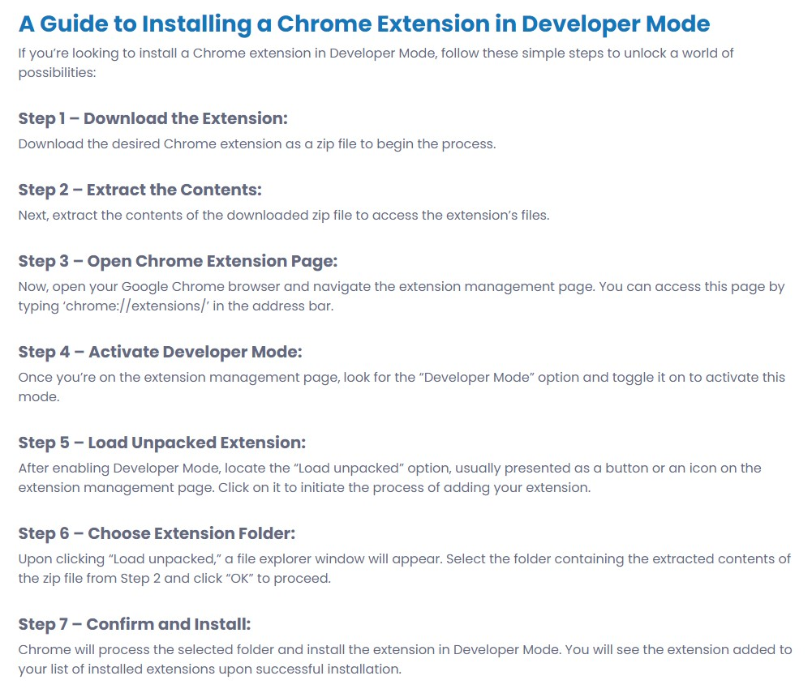

# DS Chrome Udvidelse

En Chrome/Edge udvidelse for DS.

## Version 0.36
Hvis man er på en Tivoli Casino Jira, og vil lave en branch, så laves branchen nu i det rigtige Tivoli Casino repository.

## Version 0.35
Oprydning, fjernet ubrugte knapper.

## Version 0.34
Synliggjort Sitecore modulfejl.

## Version 0.33
Tilføjet mulighed for at lave branches fra Jira "CW" tasks.

## Version 0.32
Tilføjet en "Focus" knap på Jirasider.

## Version 0.31
Sitecore forbedringer virker nu, udover for web.develop, også for web.trunk.

## Version 0.30
Der kan nu laves branches fra både IU og FOR jirasager.

## Version 0.29
Fixet et problem med at "rød konto" var defineret som DLI.

## Version 0.28
Tilføjet "Create branch" CTA på IU Jira tasks.

## Version 0.27
Fjernet "Lav Jira" knapper. Tilføjet webpack til build setup.

## Version 0.26
Mindre fejlrettelser.

## Version 0.25
Når man klikker på en valgmulighed i en treelist, så kommer der et link frem i bunden, som ved klik åbner en ny fane med det valgte Sitecore item.

